 

&nbsp;&nbsp;

&nbsp;&nbsp;

## 👨‍💻 About Me

- 🔧 Maintainer at **[is-a.dev](https://github.com/is-a-dev)** — free subdomain service used by thousands of devs worldwide
- 🐧 Daily driving **Linux + Windows**, currently exploring **NixOS**
- 🐳 Building with **Docker**, **CI/CD**, and self-hosted infra
- 💻 Currently learning **C** language
- 💬 Ask me about **DNS, open source, or Linux**
- 📫 **info@krsn.us.to** &nbsp;·&nbsp; 🌐 [krsn.us.to](https://krsn.us.to)

## 🛠️ Tech Stack

  

  

 

  
  

 

